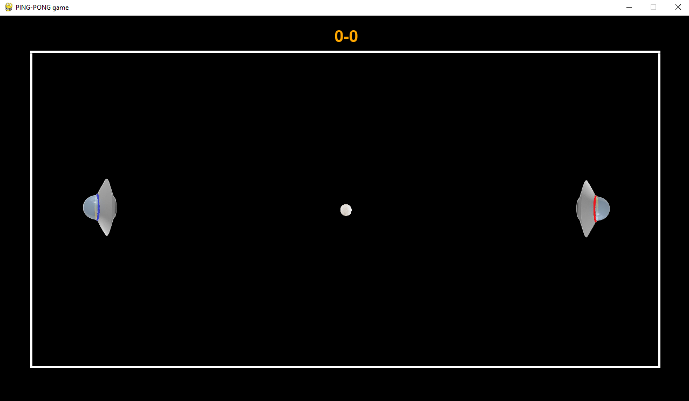

<h4 align="center">Pygame игра "Пинг-Понг"</h4><hr>

<h4 align="right" style="margin-top: 1px;">
    Реализовали: Зайцев Максим,<br>
	Ларионов Валерий<br>
    Преподаватель: Адрианова Алла Михайловна
</h4><hr>

<p>Для установки библиотек:</p>

```
pip install -r requirements.txt
```

<hr>
<h4 align="center">Игра</h4>
<ul>
    <li>Наш проект - игра "Пинг-понг", реализованная с помощью библиотеки pygame для окна размером 1280x720.</li>
    <li>Два игрока играют на одной клавитуре.</li>
    <li>Движение игроков происходит за счет "w" (первый игрок) и "стрелочка вверх" (второй игрок).</li>
    <li>На "пробел" можно менять цвет фона игры.</li>
    <li>С помощью курсора мыши можно регулировать громкость фоновой музыки.</li>
    <li>С помощью ЛКМ и ПКМ можно менять фоновую музыку.</li>
    <li>Будьте осторожны! Стены обладают магическими способностями и могут притянуть, если к ним очень близко находиться.</li>
</ul>
<hr>


<hr>
